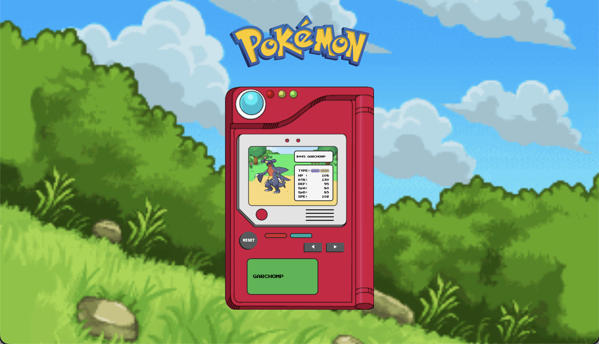

  
  

# Pokédex Website

### 📌 Project Overview
#
This is a beginner-level web project that allows users to search for Pokémon and view basic stats, including 3D Pokémon sprites and Pokémon cries.
Users can search by Pokémon name or National Pokédex Number and toggle between Pokémon using left and right arrow keys.

### 📷 Example
#

### 🎯 What I Learned
#
- Used JavaScript to add functionality to a website.
- Learned how to handle user input using HTML `<form>` and `<input>` elements.
- Improved my understanding of CSS Grid and Flexbox to create better-structured layouts.
- Learned how to fetch and work with data from a RESTful API.
- Gained experience with version control using Git commands.

### 📝 Notes
#
- This project was initially developed by combining data from multiple sources: a raw dataset from <a href="https://www.kaggle.com/datasets/rounakbanik/pokemon">Kaggle</a> for Pokémon stats, <a href="https://projectpokemon.org/home/docs/spriteindex_148/3d-models-generation-1-pokémon-r90/">Project Pokémon</a> for Pokémon sprites, and <a href="https://play.pokemonshowdown.com/audio/cries/">Pokémon Showdown</a> for Pokémon cries. However, this approach proved to be problematic because the data sources were not centralised, resulting in inconsitencies between the datasets. For example, "MrMime" vs. "Mr.Mime", and some base stats were inaccurate because they reflected Mega Evolution stats instead.
- Known limitation: searches with no matching Pokémon names are not currently handled.
- There is an easter egg in the source code!

### 📄 Credits
#
**Author:** Evan Nartea 
**Contributors:** Evan Nartea 
 
Pokémon data: https://pokeapi.co 
Pokémon type icons: https://archives.bulbagarden.net/wiki/Category:Type_icons 
Pokémon music: https://downloads.khinsider.com 
This project was inspired by: https://github.com/MilenaMartini/pokedexJs
